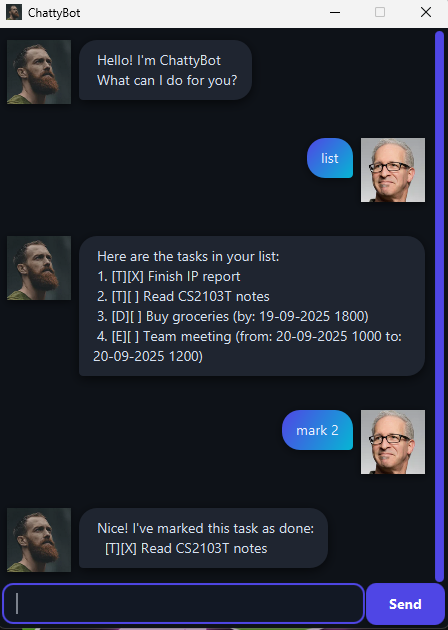

# ChattyBot User Guide

## Introduction

ChattyBot is a **desktop chatbot application** that helps you manage your daily tasks with ease.  
It supports a variety of task types, including to-dos, deadlines, and events, and even allows you  
to search or view your schedule for a specific day.

ChattyBot is optimized for use via a **Command Line Interface (CLI)**, while also providing a  
simple **Graphical User Interface (GUI)** for easier interaction.



---

## Contents

1. [Quick Start](#quick-start)
2. [Features](#features)
    - [Adding To-Dos](#1-adding-to-dos)
    - [Adding Deadlines](#2-adding-deadlines)
    - [Adding Events](#3-adding-events)
    - [Listing Tasks](#4-listing-tasks)
    - [Marking Tasks as Done](#5-marking-tasks-as-done)
    - [Unmarking Tasks](#6-unmarking-tasks)
    - [Deleting Tasks](#7-deleting-tasks)
    - [Finding Tasks](#8-finding-tasks)
    - [Exiting the Program](#9-exiting-the-program)
3. [Command Summary](#command-summary)

---

## Quick Start

1. Ensure you have **Java 17 or above** installed on your computer.
2. Download the latest `ChattyBot.jar` file from the [releases page](https://github.com/your-repo/releases).
3. Place the file in a folder of your choice.
4. Launch the application by either:
    - Double-clicking the `ChattyBot.jar` file, **or**
    - Running the following command in a terminal:
      ```bash
      java -jar ChattyBot.jar
      ```  
5. Use the GUI to interact with ChattyBot by typing commands into the input box and pressing **Enter**.

---

## Features

### 1. Adding To-Dos
Add a simple task without a date or time.

- **Format:** `todo <description>`
- **Example:** `todo Buy groceries`

---

### 2. Adding Deadlines
Add a task with a specific deadline.

- **Format:** `deadline <description> /by <date> <time>`
- **Example:** `deadline Submit assignment /by 2024-10-15 2359`

---

### 3. Adding Events
Add a task with a start and end time.
- **Format:** `event <description> /from <start> /to <end>`
- **Example:** `event Team meeting /from 2024-10-15 1400 /to 2024-10-15 1600`

---

### 4. Listing Tasks
View all tasks in the list.
- **Format:** `list`

---

### 5. Marking Tasks as Done
Mark a task as completed.
- **Format:** `mark <task number>`
- **Example:** `mark 1`
- **Note:** The task number is based on the list order.

---

### 6. Unmarking Tasks
Mark a task as incomplete.
- **Format:** `unmark <task number>`
- **Example:** `unmark 1`
- **Note:** The task number is based on the list order.

---

### 7. Deleting Tasks
Remove a task from the list.
- **Format:** `delete <task number>`
- **Example:** `delete 1`
- **Note:** The task number is based on the list order.

---

### 8. Finding Tasks
Search for tasks by keyword.
- **Format:** `find <keyword>`
- **Example:** `find assignment`

---

### 9. Exiting the Program
Close the application.
- **Format:** `bye`

---

## Command Summary

| Action        | Format, Examples |
|---------------|------------------|
| Add Todo      | `todo <description>` e.g., `todo read book` |
| Add Deadline  | `deadline <description> /by <date>` e.g., `deadline submit report /by 2024-02-28` |
| Add Event     | `event <description> /from <start> /to <end>` e.g., `event project meeting /from 2pm /to 4pm` |
| List Tasks    | `list` |
| Mark Task     | `mark <task number>` e.g., `mark 1` |
| Unmark Task   | `unmark <task number>` e.g., `unmark 1` |
| Delete Task   | `delete <task number>` e.g., `delete 1` |
| Find Tasks    | `find <keyword>` e.g., `find assignment` |
| Exit          | `bye` |

---
